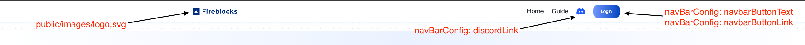
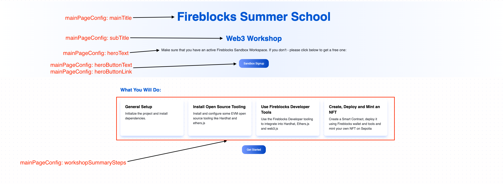
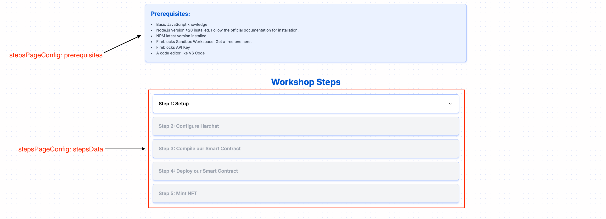

# 🎉 Customer Workshop Application

This project is a fully configurable **Next.js application** designed to run customer workshops. It features a main overview page and a step-by-step guide page, all managed through a single configuration file.

## ✨ Features

- **Configurable workshop content**: Adjust all workshop details directly from the `src/config.ts` file.
- **Two main pages**:
  - **Main page**: Overview of the workshop, including key CTAs.
  - **Steps page**: Detailed step-by-step guide for the workshop.
- **Step completion tracking**: Saves progress in local storage, allowing users to continue where they left off, even after a page refresh.
- **GitHub Pages deployment**: Preconfigured to deploy the app to GitHub Pages via GitHub Actions.

## ⚙️ Configuration

All configuration is managed via the `src/config.ts` file. Here’s an overview of the settings:

### 🌐 General Configuration (`generalConfig`)
- `basePath`: The base path for the app, used for GitHub Pages deployment. Set this to your repository name.
- `companyName`: Your company name, used for the footer text.

```typescript
export const generalConfig: GeneralConfig = {
  companyName: "your-company-name",
  basePath: "/your-repo-name"
};
```

### 🔗 Navbar Configuration (`navBarConfig`)
- `discordLink`: Link to your Discord server for support (optional).
- `navbarButtonText`: Text for the main CTA button in the navbar.
- `navbarButtonLink`: URL for the main CTA button in the navbar.
- `logoLink`: URL for the logo link in the navbar.

```typescript
export const navBarConfig: NavBarConfig = {
  discordLink: "https://discord.gg/your-discord-link",
  navbarButtonText: "Login",
  navbarButtonLink: "https://your-cta-link.com",
  logoLink: "https://your-company-link.com"
};
```

### 🏠 Main Page Configuration (`mainPageConfig`)
- `mainTitle`, `subTitle`, `heroText`, `heroButtonText`, `heroButtonLink`: Configure the main hero section of the workshop overview page.
- `workshopSummarySteps`: Summary steps that describe the workshop flow.

```typescript
export const mainPageConfig: MainPageConfig = {
  mainTitle: "Your Workshop Title",
  subTitle: "Your Workshop Subtitle",
  heroText: "Your hero text goes here.",
  heroButtonText: "Get Started",
  heroButtonLink: "https://your-cta-link.com",
  workshopSummarySteps: [
    { title: "Step 1", text: "Description of step 1." },
    // Add more steps as needed
  ],
};
```

### 📝 Steps Page Configuration (`stepsPageConfig`)
- `stepsData`: Define the steps for the workshop, including titles and corresponding markdown files.
- `prerequisites`: List of prerequisites needed before starting the workshop.

```typescript
export const stepsPageConfig: StepsPageConfig = {
  stepsData: [
    { id: 1, title: "Step 1: Setup", file: "step1.md" },
    // Add more steps as needed
  ],
  prerequisites: [
    { text: "Basic JavaScript knowledge" },
    // Add more prerequisites as needed
  ],
};
```

## 🗂️ Project Structure

- **Main Page**: The overview page, located at the base path (e.g., `/your-repo-name`).
- **Steps Page**: The workshop guide, located at `/your-repo-name/steps`.

## 🛠️ Customization

1. **Workshop Steps**: Add your markdown files under the `src/guides` directory and reference them in `stepsData` in `stepsPageConfig`.
2. **Logo**: Place your logo image in `public/images/logo.svg`.
3. **Background**: If needed, place a background image in `public/images/background.svg`.

### Navbar Customization:


### Main Page Customization:


### Steps Page Customization:


## 🚀 Deployment to GitHub Pages

1. Set the `basePath` in `generalConfig` to your GitHub repository name.
2. Push the project to your GitHub repository.
3. Configure GitHub Pages to use "GitHub Actions" as the source for building and deploying.

## 🏁 Getting Started

1. **Clone this repository**:
   ```bash
   git clone https://github.com/your-username/your-repo-name.git
   ```
2. **Install dependencies**:
   ```bash
   npm install
   ```
3. **Configure the project**:
   Adjust the `src/config.ts` file as needed.
4. **Start the development server**:
   ```bash
   npm run dev
   ```
5. **Build the project for production**:
   ```bash
   npm run build
   ```
6. **Deploy to GitHub Pages**:
   Push the code to your repository and set the GitHub Pages source to "GitHub Actions."

## 📜 License

This project is licensed under the MIT License.
